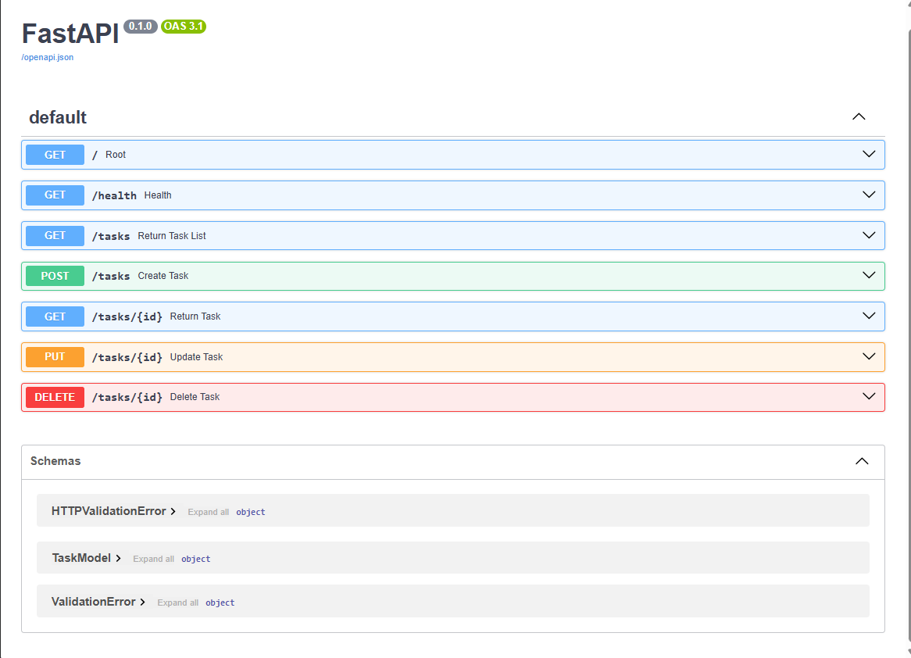
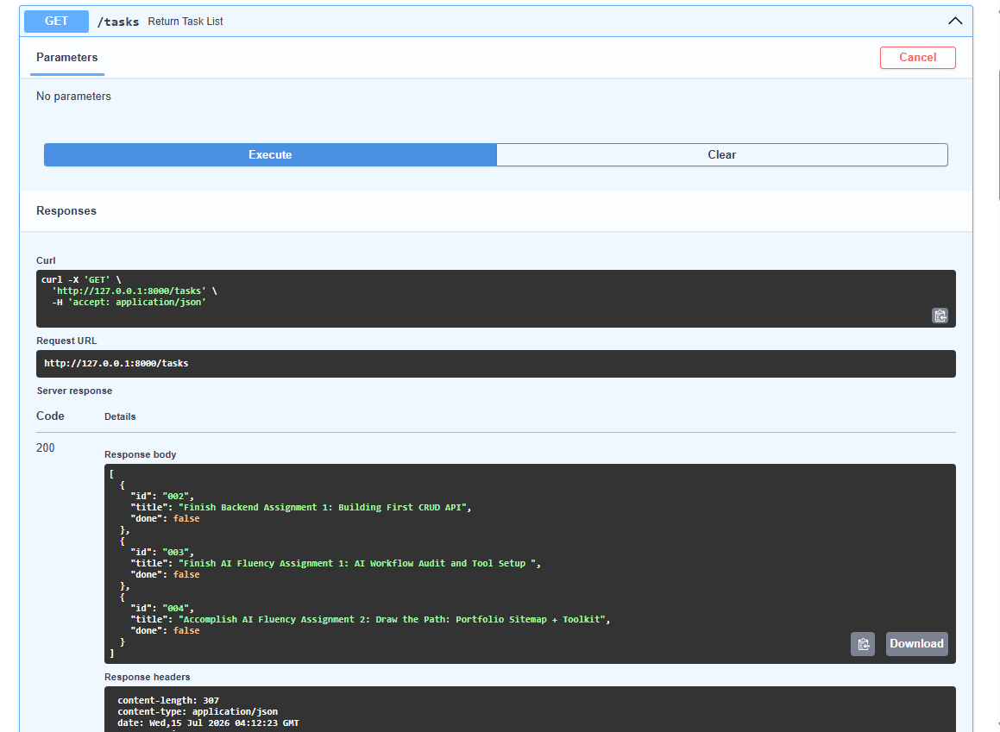
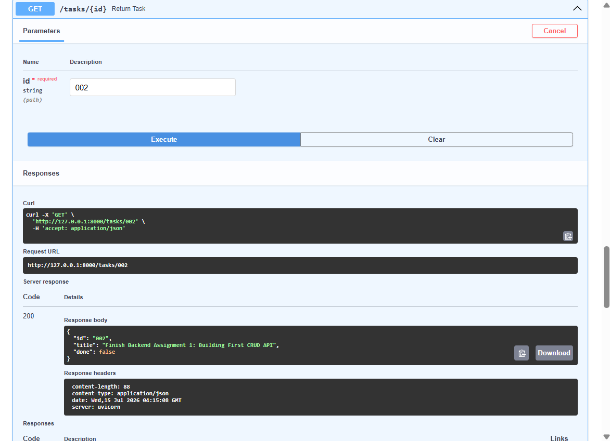
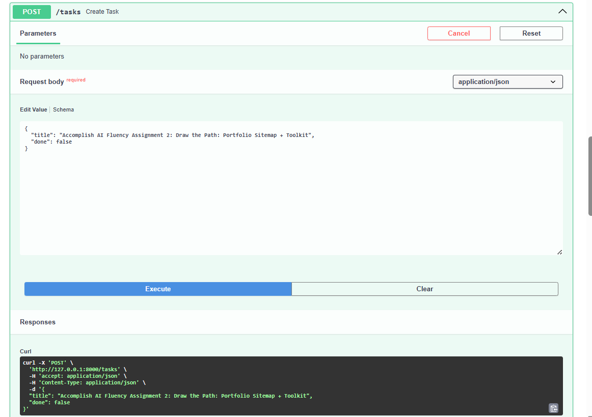
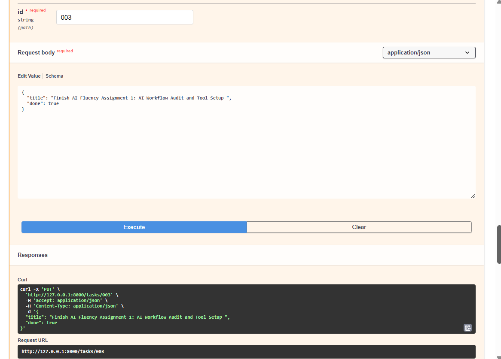
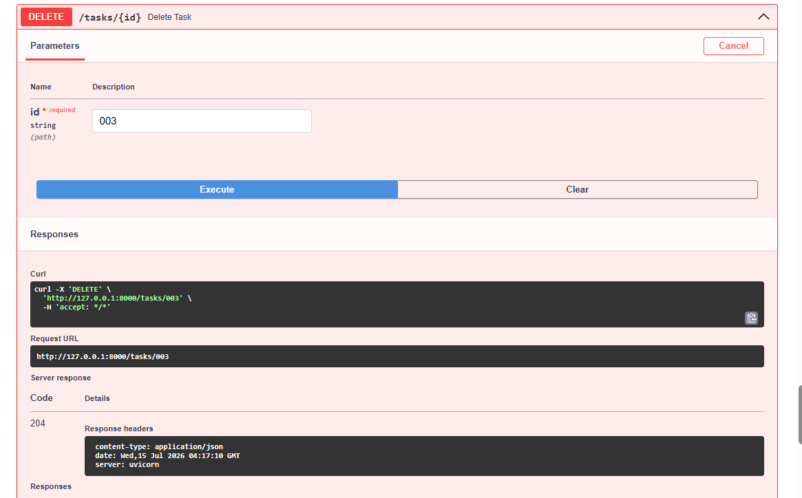

# 🚀 Task API - FlyRank Backend Assignment (BE-01)


A simple CRUD (Create, Read, Update, Delete) REST API built using **FastAPI** and **Python**.

This project was developed as part of the **FlyRank AI Internship – Backend AI Engineering Track (Week 2 Assignment)** to demonstrate the fundamentals of backend development, API design, HTTP methods, status codes, request validation, and interactive API documentation through Swagger UI.

---

## 📖 Assignment Overview

The goal of this assignment was to build a small API capable of managing a to-do list using the four core CRUD operations:

- Create tasks
- Read tasks
- Update tasks
- Delete tasks

The API stores data in memory using a Python list, allowing focus on API fundamentals before introducing databases in later assignments.

---

## 🛠️ Technologies Used

| Technology   | Purpose                       |
| ------------ | ----------------------------- |
| Python 3.10+ | Programming Language          |
| FastAPI      | Backend Web Framework         |
| Pydantic     | Request Validation            |
| Uvicorn      | ASGI Server                   |
| Swagger UI   | Interactive API Documentation |

---

## 🧠 Thought Process

The implementation was built incrementally following the assignment stages:

### Stage 1: Root & Health Endpoints

Created basic endpoints to verify that the API was running correctly.

```http
GET /
GET /health
```

### Stage 2: Read Operations

Implemented retrieval of:

- All tasks
- Individual tasks by ID

Added proper `404 Not Found` handling for unknown task IDs.

### Stage 3: Create Operation

Implemented task creation using:

```json
{
  "title": "New Task",
  "done": false
}
```

Used a Pydantic model to validate incoming request data and automatically generate API schemas.

### Stage 4: Update & Delete Operations

Implemented:

- Task updates using PUT
- Task deletion using DELETE

Added proper status codes and error handling.

### Stage 5: Swagger Documentation

Leveraged FastAPI's built-in OpenAPI support.

Interactive documentation is automatically available at:

```text
/docs
```

This allows testing every endpoint directly from the browser without using external tools.

---

## 📂 Project Structure

```text
.
├── main.py
├── README.md
```

---

## ▶️ Installation

### Clone Repository

```bash
git clone https://github.com/YOUR_USERNAME/task-api.git

cd task-api
```

### Create Virtual Environment

```bash
python -m venv venv
```

### Activate Environment

Windows:

```bash
venv\Scripts\activate
```

Mac/Linux:

```bash
source venv/bin/activate
```

### Install Dependencies

```bash
pip install "fastapi[standard]"
```

### Run Server

```bash
fastapi dev main.py --port 8000
```

Server runs at:

```text
http://127.0.0.1:8000
```

---

## 📋 Available Endpoints

| Method | Endpoint      | Description     |
| ------ | ------------- | --------------- |
| GET    | `/`           | API Information |
| GET    | `/health`     | Health Check    |
| GET    | `/tasks`      | Get All Tasks   |
| GET    | `/tasks/{id}` | Get Single Task |
| POST   | `/tasks`      | Create Task     |
| PUT    | `/tasks/{id}` | Update Task     |
| DELETE | `/tasks/{id}` | Delete Task     |

---

## 📦 Sample Response

### GET /tasks

```json
[
  {
    "id": "001",
    "title": "Finish Claude 101 Anthropic Course",
    "done": false
  },
  {
    "id": "002",
    "title": "Finish Backend Assignment 1: Building First CRUD API",
    "done": false
  },
  {
    "id": "003",
    "title": "Finish AI Fluency Assignment 1: AI Workflow Audit and Tool Setup",
    "done": false
  }
]
```

---

## 🔍 Example cURL Request

Create a Task:

```bash
curl -i -X POST http://127.0.0.1:8000/tasks \
-H "Content-Type: application/json" \
-d "{\"title\":\"Study FastAPI\",\"done\":false}"
```

Example Response:

```http
HTTP/1.1 201 Created

{
  "id": "004",
  "title": "Study FastAPI",
  "done": false
}
```

---

## 📑 Swagger UI

FastAPI automatically generates interactive API documentation.

Access Swagger UI at:

```text
http://127.0.0.1:8000/docs
```

### Add Screenshot Here








---

## ⚠️ Current Limitations

This project intentionally stores data in memory.

Because no database is used:

- Tasks disappear when the server restarts.
- Data is not persisted between sessions.
- IDs are generated based on the current list length.

This limitation helps demonstrate why databases are introduced in real-world backend systems.

---

## ✅ Requirements Checklist

- [x] FastAPI server running locally
- [x] Root endpoint
- [x] Health endpoint
- [x] Read all tasks
- [x] Read single task
- [x] Create task
- [x] Update task
- [x] Delete task
- [x] Proper status codes
- [x] 404 error handling
- [x] Request validation using Pydantic
- [x] Swagger UI documentation

---

## 🎯 Learning Outcomes

Through this assignment I learned:

- How REST APIs work
- CRUD operations
- HTTP methods and status codes
- Path parameters
- Request validation with Pydantic
- Error handling using HTTPException
- FastAPI routing
- Swagger/OpenAPI documentation
- Backend development fundamentals

---

## 👩‍💻 Author

**Leila Arowen A. Dumindin**

BS Computer Engineering
Pamantasan ng Lungsod ng Maynila (PLM)

FlyRank AI Internship – Backend AI Engineering Track
